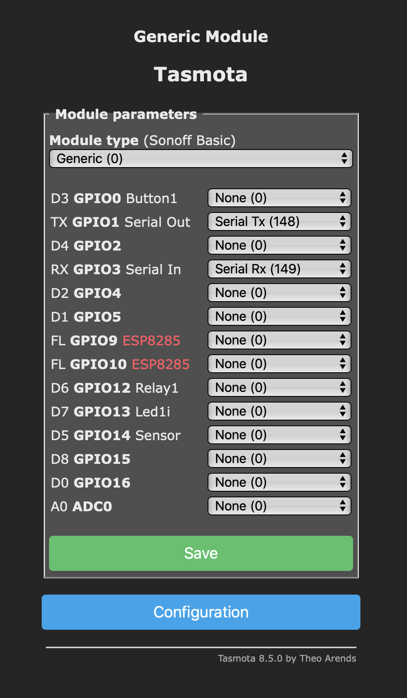

# arduino_pwm_fan

## Usage

### Setup

Fan pins: 3, 5, 9, 10

Switch pins: 2, 4, 7, 12

### Commands

{'id':0,'value':100}

{'id':'all','value':50}

{'cmd','debug'}

{'cmd','restart'}


## Homeassistant with tasmota (fan speed needs to be fixed)
### Tasmota esp01



In console set baudrate
```
Baudrate 57600
```

### Home assistant
Change tasmota_XXXXXX to your own

```yaml
input_number:
  fan0:
    name: 'fan0 speed'
    initial: 0
    min: 0
    max: 100
    step: 1
```
```yaml
automation:
  - alias: 'fan0'
    trigger:
        - platform: state
        entity_id: input_number.fan0
    action:
        - service: mqtt.publish
        data_template:
            topic: cmnd/tasmota_XXXXXX/SerialSend
            payload: "{'id':0,'value':{{ states.input_number.fan0.state | int }}}"
```
```yaml
sensor:
  - platform: mqtt
    name: fan0
    availability_topic: tele/tasmota_XXXXXX/LWT
    payload_available: 'Online'
    payload_not_available: 'Offline'
    state_topic: tele/tasmota_XXXXXX/RESULT
    value_template: '{{ value_json.SerialReceived.fans[0].value }}'
```
```yaml
fan:
  - platform: template
    fans:
        fan0:
        friendly_name: 'fan0'
        value_template: >-
            
            
            on
            
            off
            
        speed_template: '{{ states.sensor.fan0.state | int }}'
        turn_on:
            service: input_number.set_value
            data_template:
            entity_id: input_number.fan0
            value: '100'
        turn_off:
            service: input_number.set_value
            data_template:
            entity_id: input_number.fan0
            value: '0'
        set_speed:
            service: input_number.set_value
            data_template:
            entity_id: input_number.fan0
            value: '{{ speed | int }}'
```
